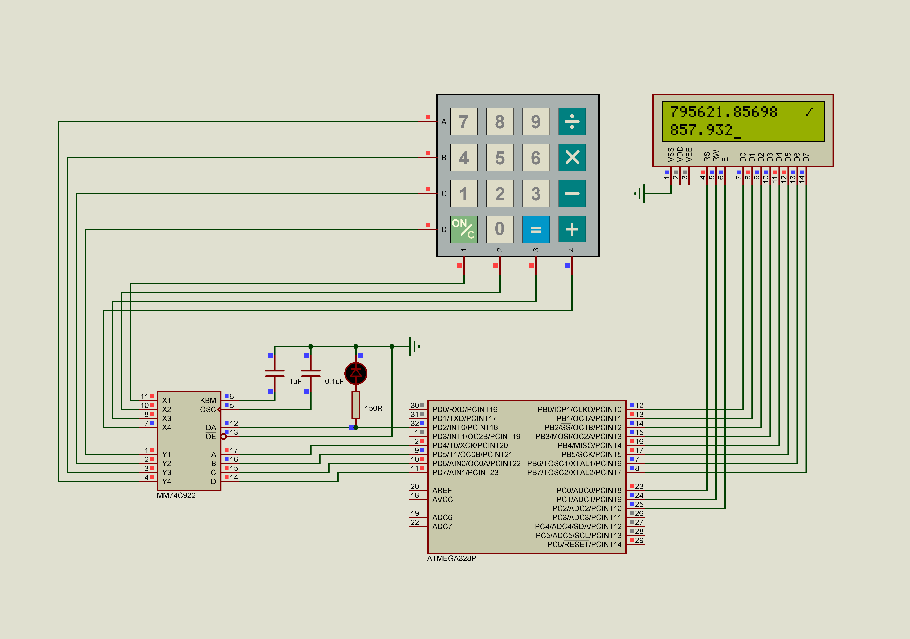
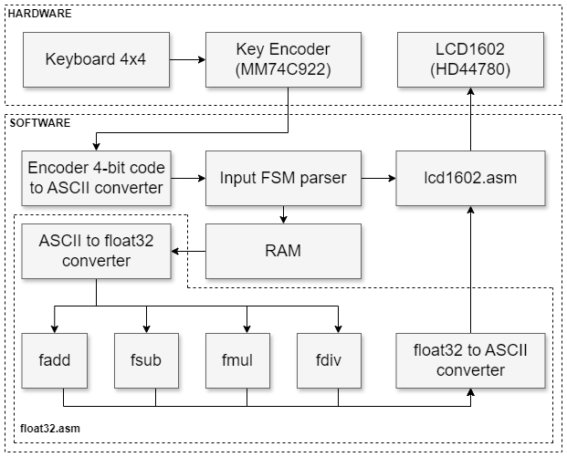
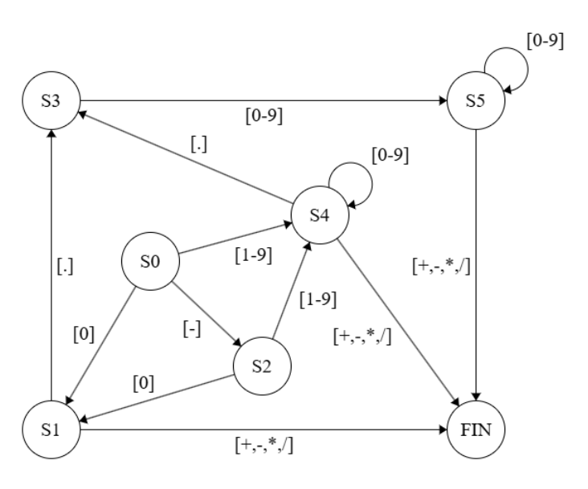
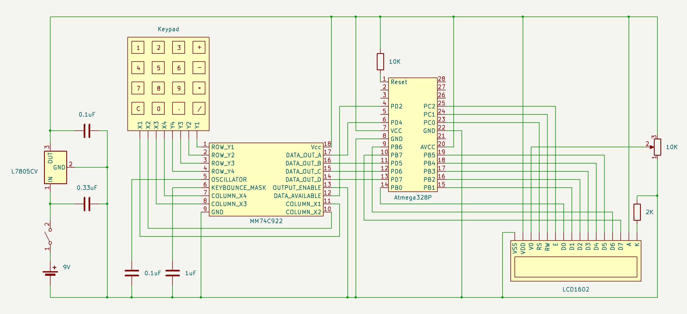

# Hardware Calculator From Scratch
English version is located in [en](https://github.com/igor-240340/HardwareCalculatorFromScratch/tree/en) branch.

[Страница](https://hackaday.io/project/197623-hardware-calculator-from-scratch) проекта на Hackaday.

Этот репозиторий содержит полный код прошивки для калькулятора, построенного на базе микроконтроллера AVR ATmega328P.

https://github.com/user-attachments/assets/c9621d69-dfed-499c-8f88-36c1198a2822

## Обзор

Калькулятор построен на основе двух кастомных библиотек:

- **float32avr.asm** - Программная эмуляция плавающей точки.
- **lcd1602.asm** - Библиотека для работы с ЖК-дисплеем LCD1602 на базе контроллера HD44780.

Репозиторий библиотеки `float32avr.asm` с документацией находится [здесь](https://github.com/igor-240340/Float32AVR).

Репозиторий библиотеки `lcd1602.asm` находится [здесь](https://github.com/igor-240340/LCD1602-HD44780-AVR).

Этот репозиторий содержит только копии последних версий указанных библиотек.

## Документация

Основной источник информации по устройству калькулятора и его разработке - учебное пособие, в котором описана вся теория, стоящая за калькулятором (основы машинной арифметики, программная эмуляция плавающей точки, ввод/вывод и др.). Его можно скачать [здесь](docs/Hardware%20Calculator%20From%20Scratch.%20The%20Tutorial.odt).

Также, есть симуляция калькулятора в Proteus, которую можно найти [здесь](docs/HardwareCalculatorFromScratch.pdsprj):

### Дополнительная информация
Еще есть архив, в котором собраны абсолютно все артефакты, созданные за время разработки калькулятора: диаграммы, иллюстрации, таблицы, заметки и пр. Архив находится [здесь](https://archive.org/details/hardware-calculator-from-scratch.-7z_202504). Там хаос, но можно найти что-то полезное и интересное.

Вот список программ для открытия некоторых файлов в этом архиве по их расширениям:
- **.odt**: LibreOffice Writer.
- **.ods**: LibreOffice Calc. Эти таблицы содержат симуляцию разрядной сетки и макросы для двоичной арифметики, написанные на BASIC. Возможно, они будут работать в Excel, но я не проверял, поэтому рекомендую открывать таблицы в LibreOffice Calc.
- **.drt**: Блок-схемы. Открывать в ИС Дракон. Это более удобная нотация взамен классическим блок-схемам. Программу ИС Дракон можно скачать [здесь](https://cloud.mail.ru/public/ecbde70c784a/%D0%98%D0%A1%20%D0%94%D1%80%D0%B0%D0%BA%D0%BE%D0%BD).
- **.xmind**: Приложение Xmind для майнд-мэппинга.
- **.drawio**: Открывать в draw.io.

## Архитектура и принцип работы

Ниже дана общая блок-схема:

### Ввод чисел

Энкодер считывает нажатые клавиши и выдает 4-битный код в диапазоне от 0x0 до 0xF. Таблица ASCII-кодов клавиш хранится в RAM. Младший полубайт адреса начала таблицы содержит ноль. Когда клавиша нажата, ее 4-битный код подставляется в младший полубайт адреса таблицы, давая доступ к ASCII-коду клавиши, хранящемуся по этому адресу.

Для предотвращения ввода некорректных числовых строк реализован конечный автомат для обработки нажатий клавиш. Диаграмма состояний представлена ниже:

Текущее состояние хранится в стеке как адрес метки, на которую программа должна перейти при следующем прерывании клавиатуры.

### Конвертация операндов

После ввода первого операнда и нажатия клавиши оператора числовая строка преобразуется в формат с плавающей точкой одинарной точности. Арифметический оператор сохраняется как ASCII-код клавиши оператора.

После ввода второго операнда он также преобразуется в `float`, считывается первый операнд, анализируется оператор, и вызывается одна из четырех подпрограмм библиотеки эмуляции операций с плавающей точкой.

Результат нормализуется до одного значащего десятичного разряда перед запятой и преобразуется в строку в экспоненциальном формате.

### Вывод на экран

Библиотека `lcd1602.asm` реализует самый простой режим взаимодействия с контроллером дисплея - 8-битная шина с синхронным ожиданием busy-флага. Также реализованы вспомогательные подпрограммы управления курсором и очистки экрана.

### Ошибки вычислений

В отличие от коммерческих калькуляторов, числа в этом калькуляторе представлены в формате двоичной плавающей точки, а не в двоично-десятичном формате (BCD). Поэтому точность результата зависит не только от доступной разрядности.

Источники ошибок включают:

- **Особенности формата двоичной плавающей точки**:
  - Не все десятичные числа можно точно представить в двоичном формате даже при бесконечной разрядной сетке. Классический пример - число 0.1. Проще говоря, если исходное десятичное число можно разложить в сумму степеней двойки и разрядности достаточно, то такое число будет представлено точно в двоичном виде (при условии, что алгоритм конвертации даёт в общем случае наилучшее приближение, т.е. сам не является источником ошибок). В остальных случаях мы получим только приближение к исходному десятичному числу.
  - При вычислениях, из-за ограниченной разрядной сетки, в общем случае, неизбежно происходит округление.
- **Конвертация десятичной числовой строки в формат бинарной плавающей точки**: Поскольку алгоритм конвертации реализует наивную схему, которая не использует арифметику с произвольной точностью, а использует ту же самую плавающую точку одинарной точности, что и для арифметический действий, может произойти округление при промежуточных вычислениях во время конвертации, которое приводит к искажению исходного десятичного числа, введенного пользователем (даже если исходное число точно представимо в двоичном виде).
- **Конвертация числа в формате плавающей точки в десятичную строку**: Хотя любое двоичное число в `float` может быть представлено точно в десятичном виде, в этом калькуляторе, также как и в случае преобразования строки в число, используется наивная схема, базирующаяся на бинарной плавающей точке одинарной точности, поэтому возможно округление при промежуточных вычислениях, которое приводит к искажению десятичного представления исходного двоичного числа.

## Принципиальная схема

## Сборка
Проект был разработан в устаревшей версии AVR Studio 4 и не проверялся в Microchip Studio for AVR.

[Здесь](https://archive.org/details/avr.7z) можно скачать все архивные инструменты, необходимые для сборки.
