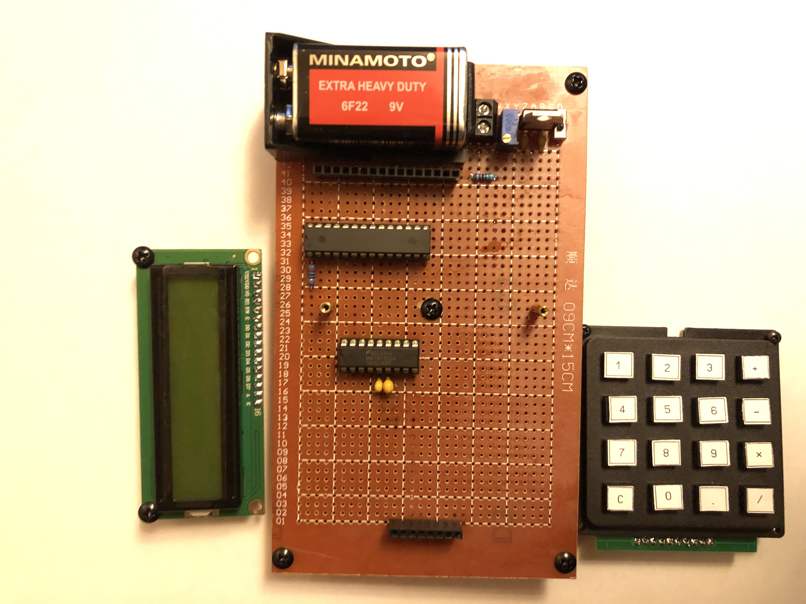

# Hardware Calculator From Scratch

This repository contains the complete firmware code for a calculator running on an AVR microcontroller ATmega328P.

https://github.com/user-attachments/assets/c9621d69-dfed-499c-8f88-36c1198a2822

## Overview

The calculator is built upon two custom libraries:

- **float32.asm** - Software emulation of floating-point arithmetic.
- **lcd1602.asm** - Library for interfacing with the LCD1602 based on the HD44780 controller.

The `float32.asm` repository with documentation can be found [here](https://github.com/igor-240340/Float32AVR).

The `lcd1602.asm` repository is located [here](https://github.com/igor-240340/LCD1602-HD44780-AVR).

This repository contains only copies of the latest versions of the aforementioned libraries.

## Architecture and Operation

A bird's-eye block diagram is provided below:

### Input of Numbers

An encoder scans key presses and outputs a 4-bit code ranging from 0x0 to 0xF. An ASCII code table corresponding to the keyboard keys is stored in RAM. The table is arranged so that the lower nibble of the address equals zero. When any key is pressed, its 4-bit code is used to access the table and retrieve its ASCII code.

To prevent the input of invalid numeric strings, a simple finite state machine is implemented to parse key presses. The state diagram is presented below:

The current state is stored in the stack as the address of the label to which the program should jump during the next keyboard interrupt.

### Operand Conversion

After the first operand is entered and the operator key is pressed, the decimal numeric string is parsed and converted into a single-precision floating-point format. The operator is stored as the ASCII code of the operator symbol.

Once the second operand is entered, it is also converted to `float`, the first operand is retrieved, the operator is analyzed, and one of the four subroutines from the floating-point emulation library is called.

The resulting value is pre-normalized to one non-zero decimal digit before the decimal point and converted into a decimal string in exponential format.

### Display Output

The `lcd1602.asm` library implements the simplest mode of interaction with the display controller—an 8-bit bus with synchronous waiting for the busy flag. Additionally, auxiliary subroutines for cursor control and screen clearing are implemented.

### Calculation Errors

Unlike commercial calculators, numbers in this calculator are represented in binary floating-point format, not in binary-coded decimal (BCD) format, so the accuracy of the result depends not only on the available precision.

Sources of errors include:

- **Characteristics of the binary floating-point format**:
  - Not all decimal numbers can be precisely represented in binary form, even with an infinite precision grid. A classic example is the number 0.1. Simply put, if the original decimal number can be expressed as a sum of powers of two, and the binary precision grid is large enough, then such a decimal number will be represented exactly (assuming the conversion algorithm provides the best approximation). In other cases, the conversion will yield only an approximation of the original decimal number.
  - During calculations, due to the limited precision grid, the result is inevitably rounded (by default to the nearest, with ties going to the even number).
- **Conversion of a decimal string to binary floating-point format**: Since the conversion is based on a naive scheme that does not use arbitrary-precision arithmetic but relies on the same single-precision floating-point emulation used for calculations, rounding of intermediate values can occur during conversion, leading to distortions in the original decimal value entered by the user (even if the original decimal number can be exactly represented in binary).
- **Conversion of a floating-point number to a decimal string**: Although any binary number in `float` format can have its exact decimal representation derived, in this calculator, as with the string-to-float conversion, a naive scheme based on single-precision float is used, so rounding of intermediate values can occur during conversion, ultimately distorting the entire value and specific decimal digits.

## Theory and Documentation

The primary material on the theoretical foundations of the calculator's development and some proofs related to floating-point calculations can be found in [this](docs/HardwareCalculatorFromScratch.%20Research.odt) paper (it's a little messy for now).

More details on the floating-point library `float32.asm` are located in the corresponding repository mentioned earlier.

This project also includes a fully functioning simulation in Proteus, which you can find [here](docs/HardwareCalculatorFromScratch.pdsprj):

More research notes and corresponding educational material will be added later when they are in good condition and translated into English.
